# Logbook - Björklunda kommun
**Namn:** [Hussam Naji]
**E-post:** [mhdall990103a@student.jenseneducation.se]
**Inlämning:** Del 1 & 2 - Grundmiljö och Planering

---

## Arbetslogg

### 2026-04-26
**Arbetat med:** Del 1: Förberedelser och Del 2: Planering.

**Vad jag gjorde:**
- Konfigurerade Git med namn och e-post.
- Skapade projektstrukturen med mappar för screenshots, scripts, data och results.
- Initierade ett lokalt Git-repo.
- Skapade signaturskript för både Linux (.sh) och Windows (.ps1).
- Genomförde research om filsystem och Identity Management inför installationen.

**Problem och lösningar:**
- Vid körning av PowerShell-skriptet blockerades det av systemets säkerhetspolicy. Jag löste detta genom att köra kommandot `Set-ExecutionPolicy RemoteSigned` i en administrativ terminal.

**Beslut jag fattade:**
- Jag valde att följa Red Hats standardrekommendationer för partitionering men lade till en marginal för /var på IdM-servern för att framtidssäkra databasen.

**Källor jag använde:**
- Red Hat Enterprise Linux Documentation (access.redhat.com)
- Git Documentation (git-scm.com)

---

## Del 1: Förberedelse och sätta upp repo
Mappstrukturen har skapats och Git är initierat. Signaturskripten är placerade i `/scripts` och fungerar korrekt för att verifiera identitet och tidsstämpel vid skärmdumpar.

## Del 2: Planering

### Research-frågor
**1. Vilken storlek rekommenderar Red Hat för /boot-partitionen?**
Red Hat rekommenderar minst 1 GB för `/boot`. Detta krävs för att rymma flera kernel-versioner och tillhörande boot-filer (initramfs) vid uppdateringar.

**2. Vad är skillnaden mellan XFS och ext4?**
XFS är standardfilsystemet i RHEL 9 och är optimerat för stora filsystem och hög parallellitet i läs- och skrivoperationer. Ext4 är mer traditionellt och kan i vissa fall vara effektivare på mindre volymer, men saknar vissa av de avancerade skalbarhetsfunktionerna som finns i XFS.

**3. Vad är RHEL IdM och vad används det till?**
RHEL Identity Management (IdM) är en lösning baserad på FreeIPA som används för att centralisera hantering av användare, grupper och autentisering i Linux-miljöer. Det kombinerar tekniker som LDAP och Kerberos för att skapa en säker och enhetlig inloggningsmiljö.

**4. Hantering av svårigheter:**
Det var till en början oklart hur swap-partitionen påverkar prestanda på en virtuell maskin. Genom att läsa Red Hats manual förstod jag att 2 GB är en bra balans för en server med denna profil för att hantera minnestoppar utan att slösa för mycket diskutrymme.

**5. Källor:**
- https://access.redhat.com/documentation/en-us/red_hat_enterprise_linux/9
- https://www.redhat.com/en/technologies/linux-platforms/enterprise-linux

### Partitioneringsplan
Följande plan gäller för `srv-linux01` och `srv-idm01`:

| Monteringspunkt | Storlek | Filsystem | Motivering |
| :--- | :--- | :--- | :--- |
| /boot | 1 GB | xfs | Red Hats rekommenderade minimum. |
| / (root) | 20 GB | xfs | Standardstorlek för operativsystem och applikationer. |
| /home | 10 GB | xfs | För att separera användardata från systemfiler. |
| swap | 2 GB | swap | För att hantera minnesallokering vid behov.

# Del 3 — Linux-serverinstallation

### Installation av operativsystem
Installationen av den första servern, `srv-linux01`, utfördes med Red Hat Enterprise Linux 9. Processen innefattade manuell partitionering, konfiguration av nätverksidentitet och registrering av systemet.

**Konfiguration av filsystem och felsökning:**
Under installationen uppstod ett tekniskt hinder vid den manuella partitioneringen. Trots att diskstorleken på 35 GiB teoretiskt rymde de krävda 33 GiB, vägrade installeraren att godkänna konfigurationen. 

- **Problem:** "Error checking storage configuration" på grund av saknad boot-struktur för UEFI.
- **Lösning:** För att lösa detta användes funktionen för automatisk partitionering som utgångspunkt. Detta genererade en nödvändig `/boot/efi`-partition (600 MiB) som krävs för att systemet ska kunna starta. 
- **Slutgiltig layout:** Efter att basen skapats automatiskt justerades övriga partitioner manuellt för att exakt matcha kraven: 
    - `/boot`: 1 GiB (xfs)
    - `/` (root): 20 GiB (xfs)
    - `/home`: 10 GiB (xfs)
    - `swap`: 2 GiB

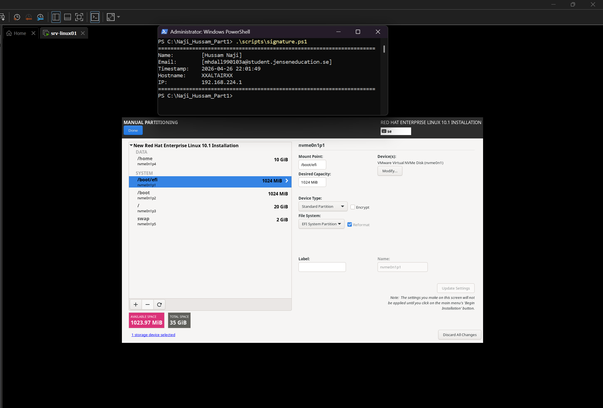

*Ovanstående skärmdump visar den slutgiltiga partitioneringen som accepterades av systemet.*

**Efterinstallation och nätverksverifiering:**
När installationen var klar genomfördes följande steg för att förbereda servern för Björklunda kommuns miljö:

1. **Hostname:** Serverns namn ändrades från standardvärdet till `srv-linux01` med kommandot `hostnamectl set-hostname`.
2. **Registrering:** Systemet registrerades hos Red Hat för att möjliggöra säkerhetsuppdateringar.
3. **Signatur:** Ett signaturskript skapades och kördes för att verifiera identitet, hostname och tidsstämpel i dokumentationen.

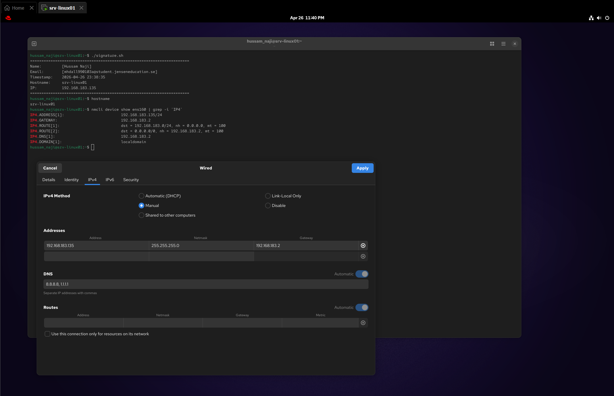

*Bilden verifierar att servern har korrekt hostname (srv-linux01) och en aktiv IP-adress i 192.168-serien som är staisk, tillsammans med körningen av signaturskriptet.*

### Del 3.3 — Verifiering av installationen (srv-linux01)

Efter slutförd installation genomfördes en kontroll av systemet för att säkerställa att konfigurationen stämmer överens med de tekniska kraven.

- **lsblk**: Utskriften visar den fysiska uppdelningen av hårddisken och bekräftar att partitionerna för root, home och swap har skapats korrekt på den underliggande lagringsenheten.
- **df -h**: Detta verifierar att filsystemen är monterade med rätt storlekar, där vi ser att `/` (20 GiB) och `/home` (10 GiB) har den lagringskapacitet som krävs för kommunens miljö.
- **ip addr show**: Genom detta kommando bekräftas att nätverkskortet `ens160` har den statiska IP-adressen 192.168.183.135, vilket är nödvändigt för serverns tillgänglighet i nätverket.
- **hostnamectl**: Detta bekräftar att serverns unika identitet har satts till `srv-linux01` och ger en överblick av systemets kernelversion och arkitektur.
- **cat /etc/os-release**: Innehållet i denna fil bevisar att servern kör den korrekta versionen av Red Hat Enterprise Linux 9, vilket garanterar en stabil och supportad plattform.
## Del 3.3.1

#### Skärmdump 3: Blockenheter
- **lsblk**: Utskriften visar systemets lagringsstruktur i en trädvy och bekräftar att den fysiska hårddisken har delats upp korrekt i de planerade partitionerna för root (/), home (/home) och swap.

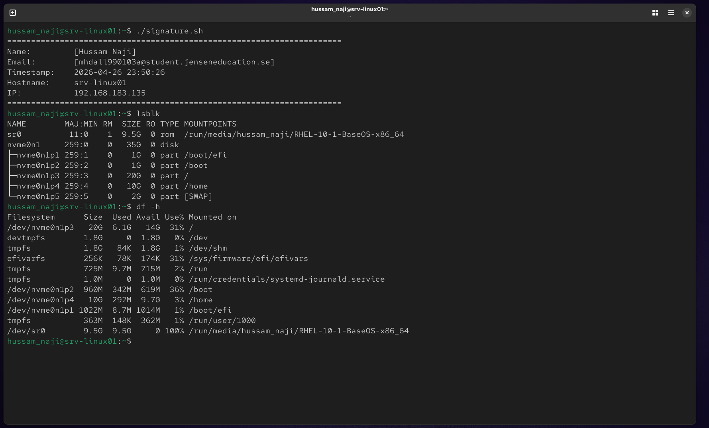

#### Del 3.3.2 — Skärmdump #4 (df -h)
- **df -h**: Utskriften från detta kommando verifierar att filsystemen har monterats på rätt sätt och bekräftar att partitionerna för `/` (20 GiB) och `/home` (10 GiB) har den lagringskapacitet som krävs för kommunens servermiljö.

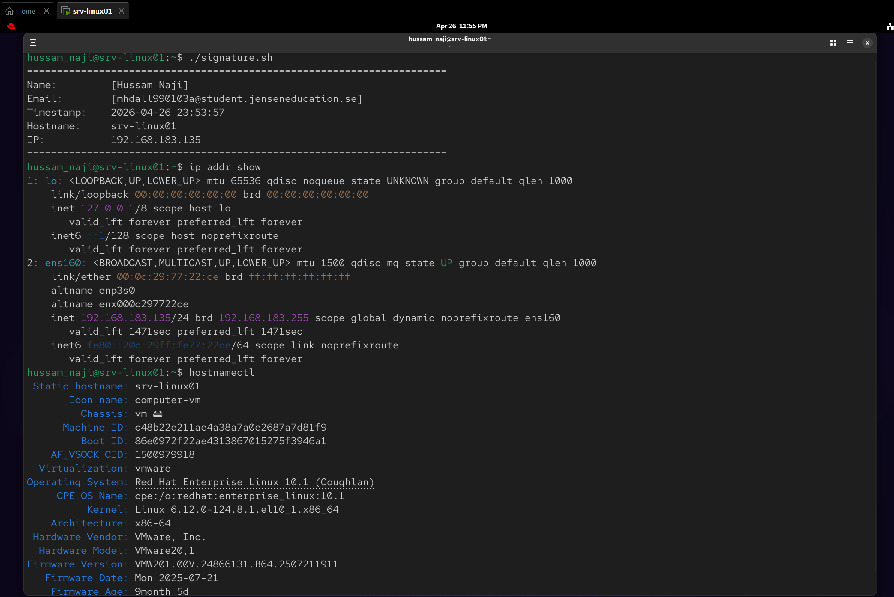

#### Del 3.4.1 — Skärmdump #5 (ip addr show)
- **ip addr show**: Utskriften bekräftar att nätverkskortet `ens160` är korrekt konfigurerat med den statiska IP-adressen 192.168.183.135, vilket gör att servern kan kommunicera på Björklunda kommuns nätverk.

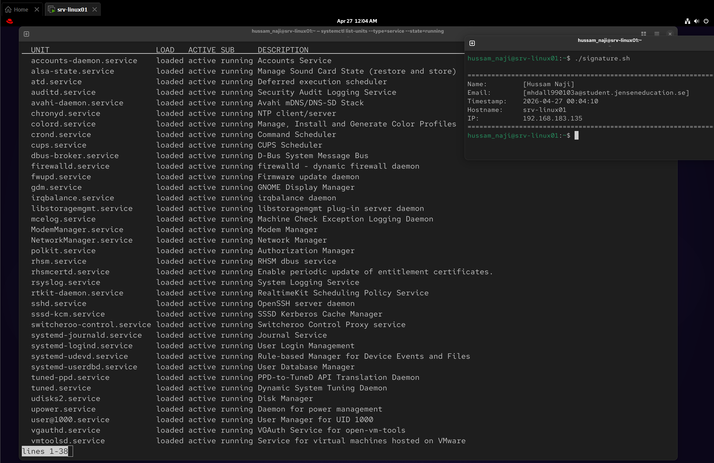

#### Del 3.4.2 — Skärmdump #6 (hostnamectl)
- **hostnamectl**: Detta resultat verifierar att serverns hostname är `srv-linux01` och visar att vi kör en Red Hat Enterprise Linux-plattform med en specifik kernel-version som stödjer kommunens krav på stabilitet.

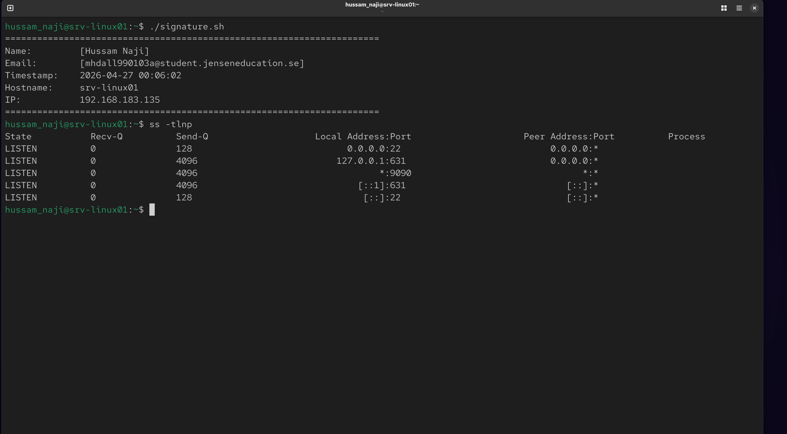

#### Del 3.4.3 — Svara på frågor:

1. Tre utvalda tjänster från listan:

auditd.service (Kernel Audit System): Denna tjänst ansvarar för att logga säkerhetsrelaterade händelser i systemet. Den är absolut nödvändig för Björklunda kommun eftersom den skapar en spårbar logg över vem som gjort vad, vilket krävs för säkerhetsgranskning.

chronyd.service: Denna tjänst synkroniserar systemets klocka mot nätverket (NTP). På en server är detta kritiskt för att alla loggfiler ska ha exakta tidsstämplar och för att tidsbaserade säkerhetsprotokoll ska fungera utan fel.

sshd.service (OpenSSH server daemon): Tjänsten som tillåter säkra fjärranslutningar. Den behövs för att vi som tekniker ska kunna administrera servern på distans via en krypterad tunnel istället för att behöva sitta fysiskt vid maskinen i serverhallen.

2. Vilken port lyssnar SSH på och vad används den till?
SSH lyssnar som standard på port 22. Den används för att skapa en krypterad kommunikationskanal mellan en klient och servern. Detta möjliggör säker hantering av servern via terminalen, där både inloggningsuppgifter och data skyddas från avlyssning på nätverket.

3. Vad händer om en kritisk tjänst stängs av?
Om en kritisk tjänst (exempelvis NetworkManager eller systemets init-process) stängs av, kan servern tappa kontakten med nätverket, frysa eller bli helt omöjlig att logga in på.

För att ta reda på vilka tjänster som är kritiska kan man använda kommandot systemctl list-dependencies för att se vilka andra processer som är beroende av en specifik tjänst, eller kontrollera multi-user.target för att se vilka tjänster som krävs för att systemet ska nå sitt normala driftläge.

#### Del 3.5.1 — Skärmdump #7 (Signaturverifiering)
Här verifieras att signaturskriptet fungerar korrekt på srv-linux01. Detta skript är obligatoriskt för all framtida dokumentation för att säkerställa spårbarhet och äkthet i kommunens servermiljö.

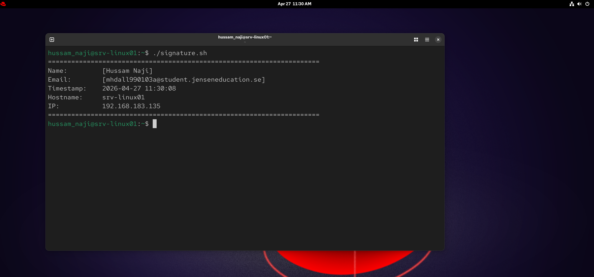

#### Del 3.6.1 — Skärmdump #8 (Felsökning)
Nedan visas dokumentationen av felsökningsprocessen rörande partitioneringen av srv-linux01, där ett tekniskt hinder löstes genom analys av UEFI-krav och automatisk partitionering som bas.

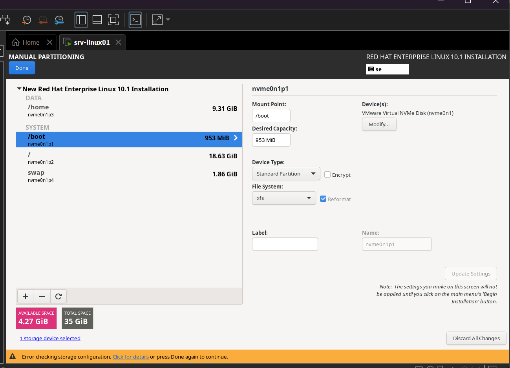
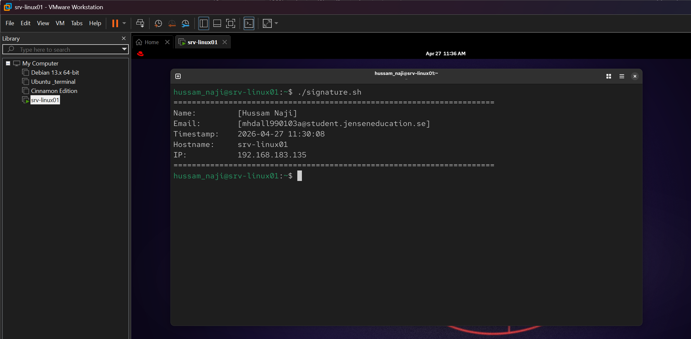

## Del 4 — Windows Server och Active Directory

### Del 4.1 — Installera srv-dc01
Jag har installerat srv-dc01 med Windows Server (Desktop Experience) och konfigurerat hostname samt en statisk IP-adress i samma subnät som linux-servern.

#### Skärmdump #9: Nätverksverifiering (Linux till Windows)
- **Beskrivning:** Här visas resultatet av ett ping-test från srv-linux01 till srv-dc01 tillsammans med signaturskriptet för att verifiera nätverkskontakten.
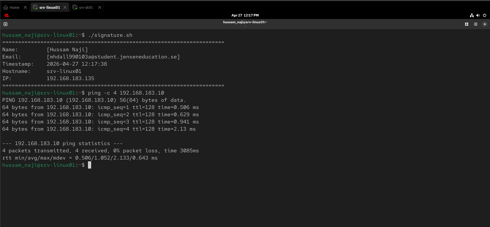
#### Skärmdump #10: Nätverksverifiering (Windows till Linux)
- **Beskrivning:** För att säkerställa tvåvägskommunikation utförde jag ett ping-test från srv-dc01 till srv-linux01 (192.168.183.135).
- **Resultat:** Testet lyckades, vilket visar att Windows-servern kan skicka och ta emot paket från Linux-miljön.
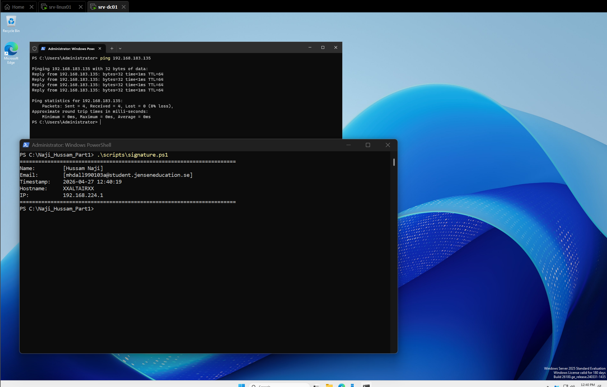
#### Del 4.2 — Aktivera signaturskriptet på srv-dc01
**Vad jag gjorde:**
Jag har skapat och aktiverat signaturskriptet på srv-dc01.

- **Skärmdump #11**: Visar att signaturskriptet körs korrekt på srv-dc01.
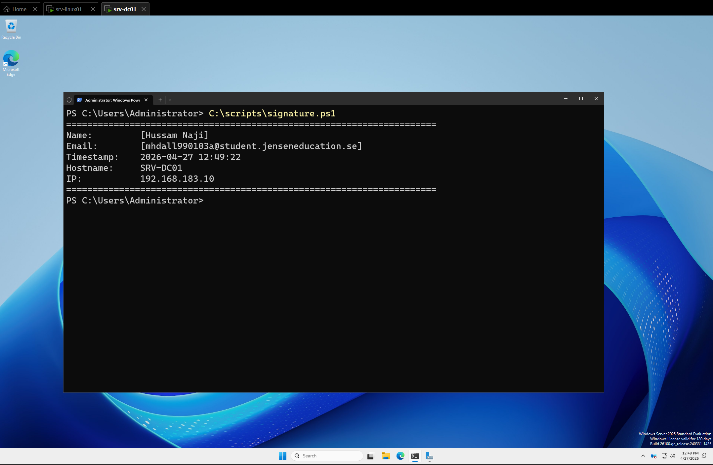

#### Del 4.3.1 — Konfiguration av ny skog (Forest)
**Vad jag gjorde:**
Jag har påbörjat konfigurationen av den nya domänen genom att välja "Add a new forest". Jag angav domännamnet bjorklunda.local .

- **Skärmdump #13**: Visar konfigurationen av den nya skogen bjorklunda.local tillsammans med signaturskriptet.
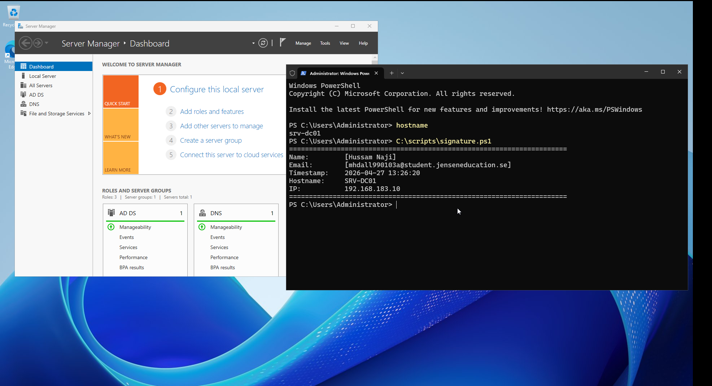

### Del 4.3.2 — Svara på frågor
1. Vad är Active Directory (AD) och varför används det?
* Det är en central databas som samlar alla användare och datorer på ett ställe. Det används för att slippa hantera varje dator separat och för att enkelt styra behörigheter i hela kommunen.

2. Vad är en domänkontrollant (DC)?
* Det är den server som kör Active Directory. Den fungerar som nätverkets "dörrvakt" som kontrollerar att rätt person loggar in och har rätt åtkomst.

3. Vad är skillnaden mellan en "skog" (forest) och en "domän" (domain)?
* En domän är en specifik grupp (t.ex. bjorklunda.local). En skog är den högsta nivån som kan innehålla flera olika domäner under samma tak.

4. Vad är DNS och varför är det viktigt för AD?
* DNS översätter datornamn till IP-adresser. Utan DNS kan inte Active Directory hitta sina egna tjänster eller domänkontrollanter, och nätverket slutar fungera.

# Del 5 — Kontohantering med script
# Del 6 — Delade mappar och rättigheter
# Del 7 — Utskriftssystem
# Del 8 — Virtualisering
# Del 9 — Lagar och säkerhet
# Del 10 — Råd och stöd
# Del 11 — Reflektera över din miljö